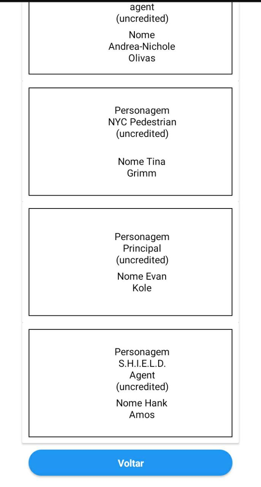
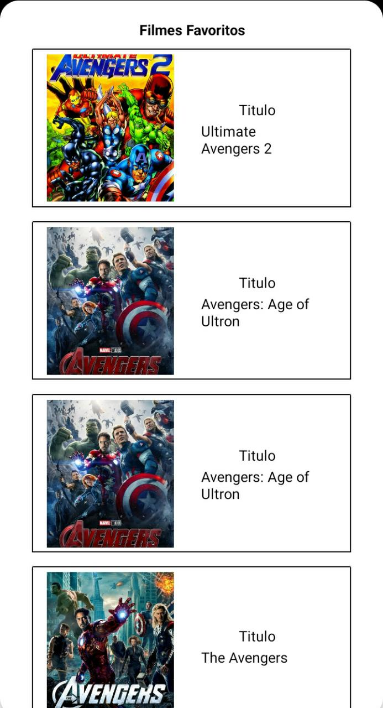
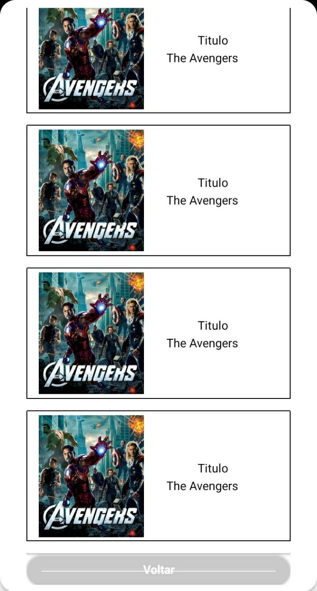

# Aplication for movies
 
 Project Init React Native
 
 ### npx react-native init nameforproject
 
 install project
 
 
### `npm install  or yarn`

Run project 

### `npm  run-android or yarn run android`

and

###  `npm start or yarn start`

# Prints Examples:

 
